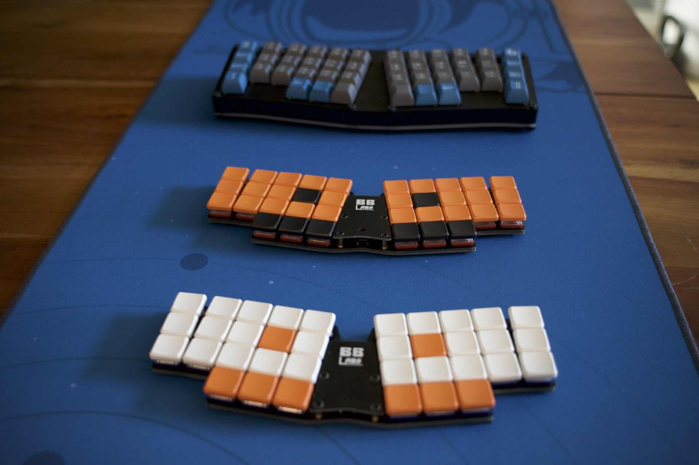
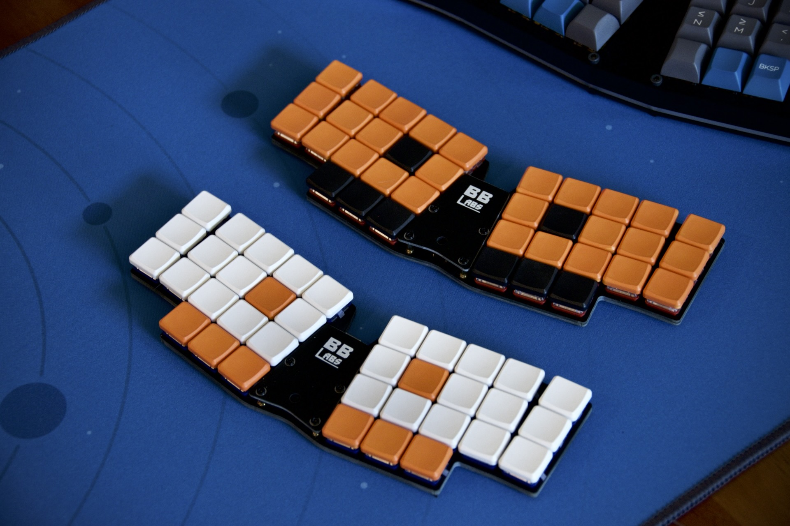
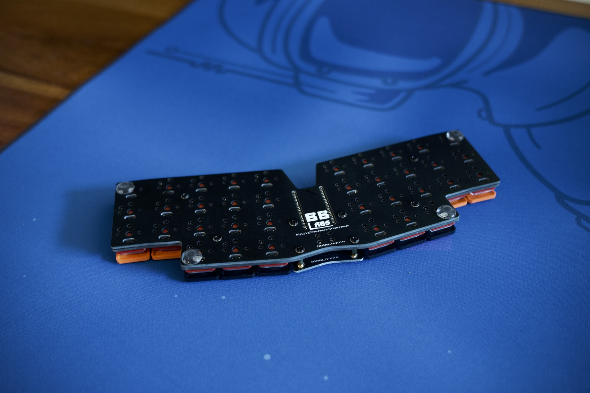
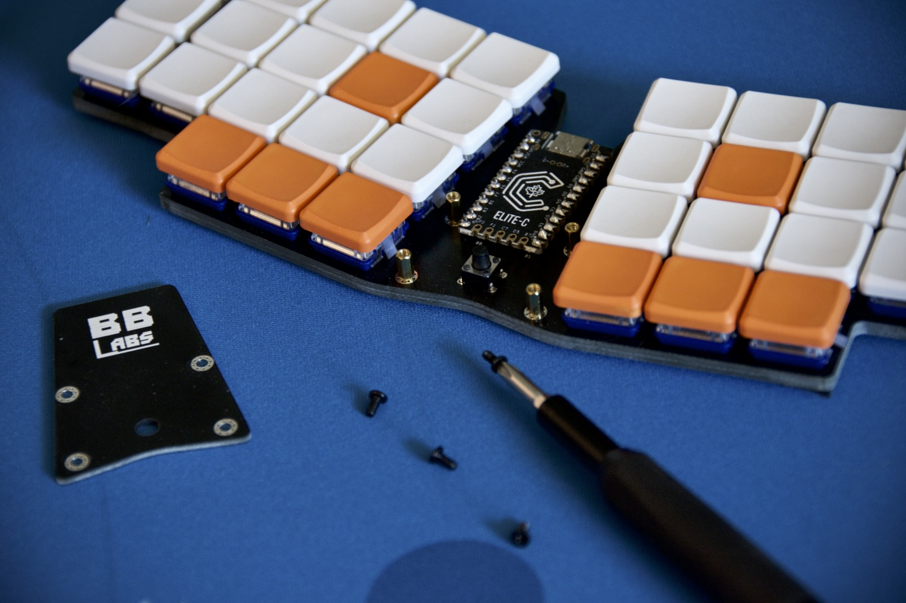
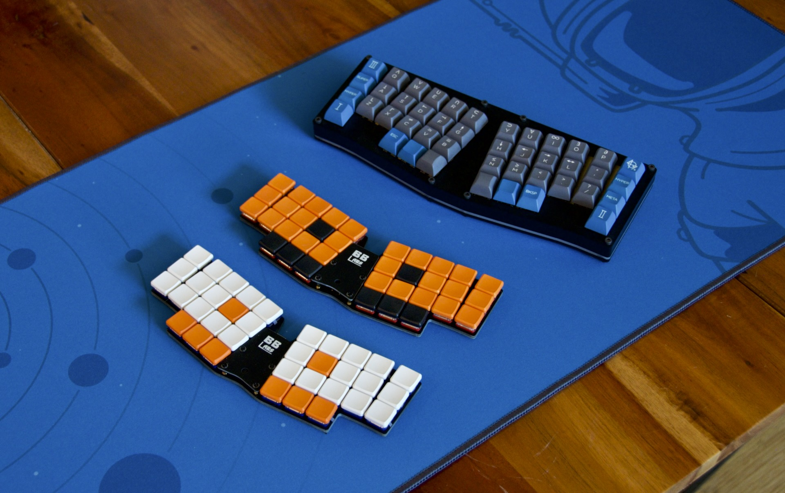

# chocV

A 36 key choc keyboard based on the [Horizon](https://github.com/skarrmann/horizon) 
construction and a trimmed down [BabyV](https://www.instagram.com/eyeohdesigns/?hl=en) layout!

## Horizon + BabyV

The Horizon features a very unique and innovative construction and when I saw it, I knew 
I had to build one... but I've become really enamoured with the [Miryoku](https://github.com/manna-harbour/miryoku)
layout on my BabyV.  So I decided to mash them together and see what happens.  
Thus the chocV was born!

## Construction

[Skarrmann](https://github.com/skarrmann/horizon) has a wonderful description of 
the concept, but the main idea is to generate at least TWO pcb's for the keyboard.  One 
standard PCB with traces and all the components, and a second which bolts directly 
under with cutouts that match all the components on the first to protect them (and your 
desk) from damage.  This ends up creating a really tidy and very low profile board.

The specific footprints used and a plugin for KiCad to enable easy generation of the 
muiltiple PCB's can be found in the Horizon repo.  It's a very clever idea which is executed
exceptionally well.  All I did was re-arrange it a bit to get a layout I prefer.  I've added 
the KiCad files I generated in this repo as an example or jumping off point for others.

## Production

I used JLCPCB, as the original did, and the boards turned out great.  If you'd like to order a set of your own, the three gerber zip files are in the /gerbers folder.  You'll need one of each to
build a full board and I suggest you take a look through the Horizon repo to get a sense for 
the build process. 

I've built two complete boards, one based on the Elite-C to serve as a wired board and one 
built around a Nice:Nano for wireless functionality.  

## Keymap / Layout

The Miryoku layout is what I use across all my boards.  It's very flexible and can be 
used/implemented on just about any physical layout.  I've used it on split boards mostly, but 
when I got the BabyV I feel like I really hit a sweet spot.  Splits are great, and they do 
feel better when I do a lot of typing, but the BabyV has a great sound, good looks, and 
monoblocks are just easier to manage on a desk... it might have a few too many keys, but 
nothing is perfect :-)

Miryoku has both a fully supported QMK build system and a work in progress system for ZMK.
If you are looking for a well thought-out minimalist layout, I can't recommend it enough.

## Build one yourself!

If you are interested in building a chocV, feel free to use the files here and to reach out with
any questions.  Happy Keyboarding!

